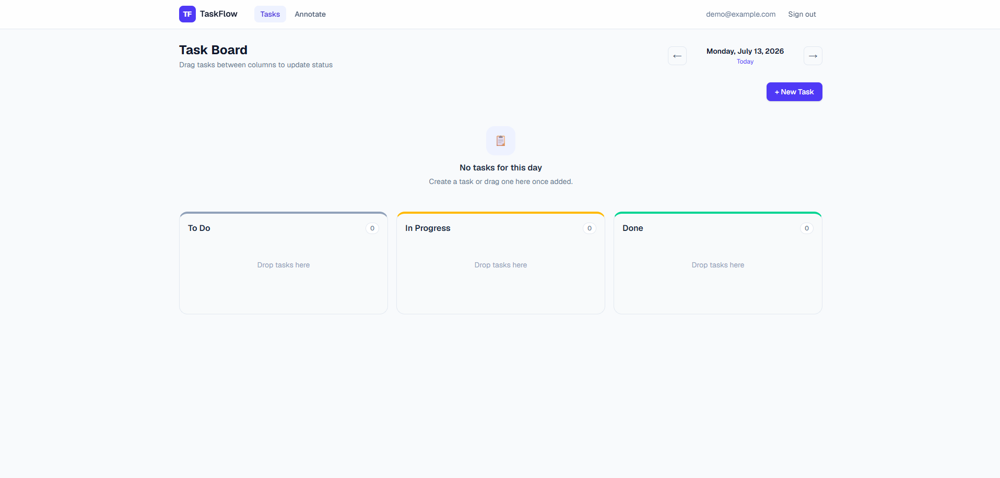
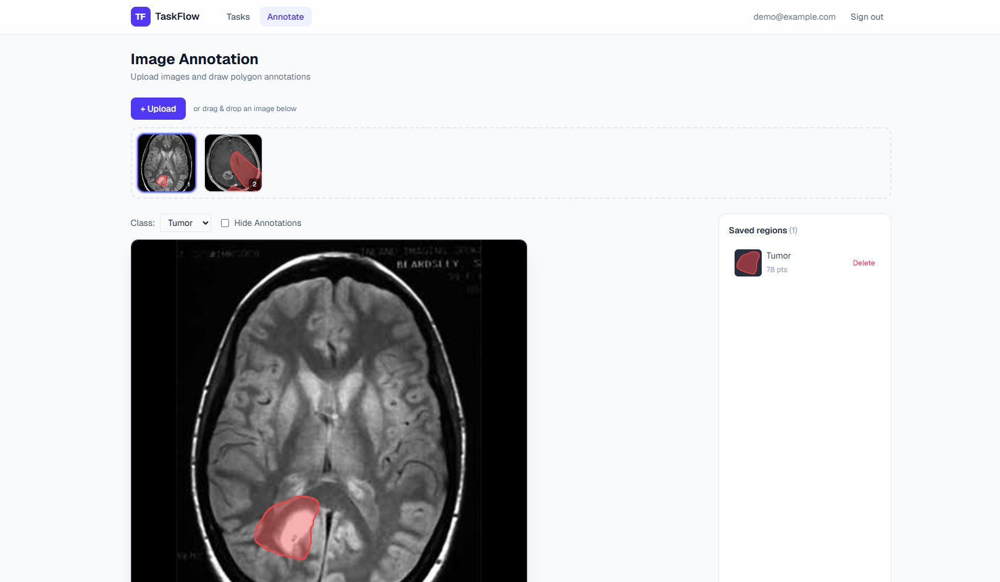
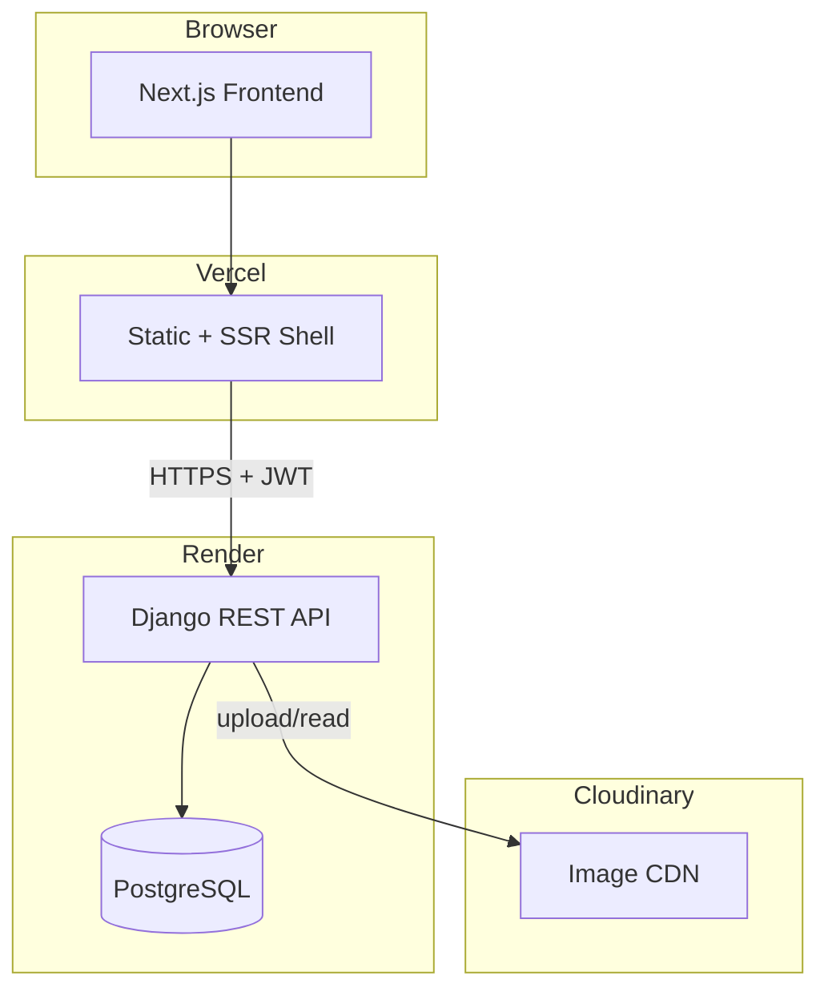
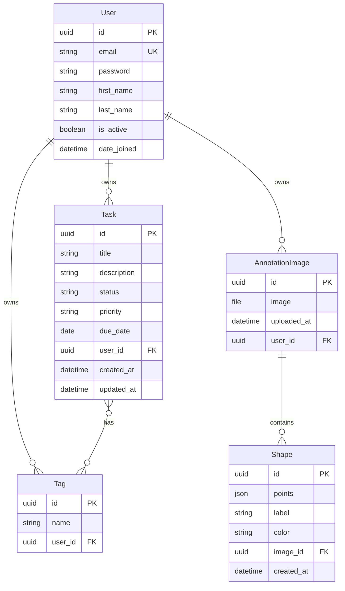
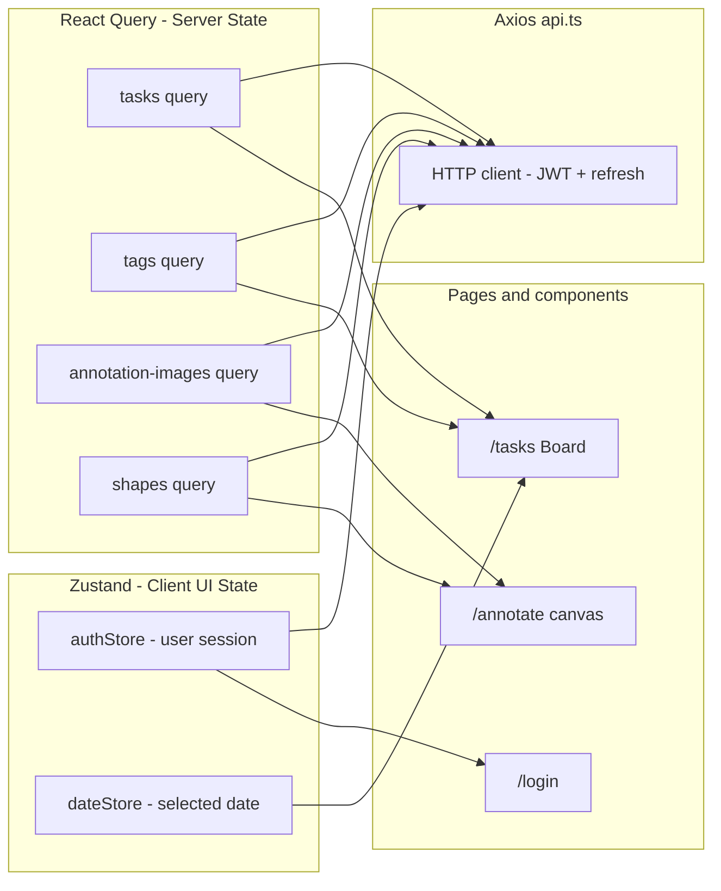
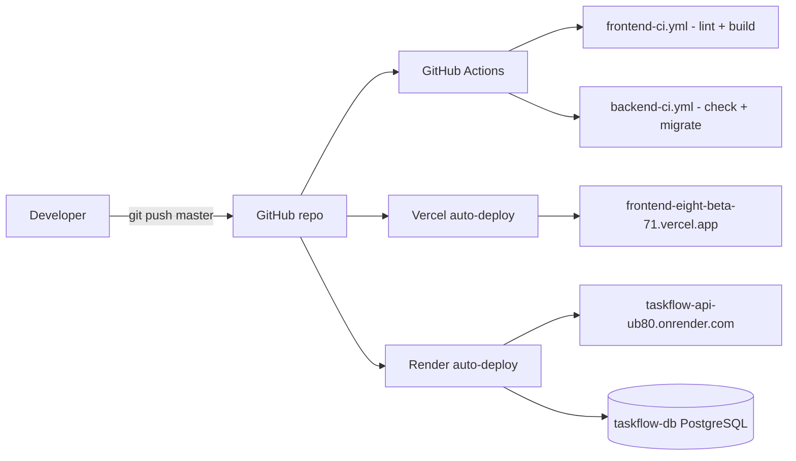

# TaskManager Annotator (TaskFlow)

Full-stack portfolio app: **Kanban task manager** + **freehand image annotation** for labeling regions on medical or general images.

**Repository:** [RAIYANBHUIYAN/TaskManager_Annotator](https://github.com/RAIYANBHUIYAN/TaskManager_Annotator)

---

## Live demo

| Service | URL | Status |
|---------|-----|--------|
| **Frontend** (Vercel) | https://frontend-eight-beta-71.vercel.app | ✅ Deployed |
| **Backend API** (Render) | https://taskflow-api-ub80.onrender.com | ✅ Deployed |
| **Health check** | https://taskflow-api-ub80.onrender.com/api/health/ | ✅ |

### Demo login

- **Email:** `demo@example.com`
- **Password:** `Demo@1234`

> **Note:** Render free tier cold-starts after idle time — the first API request may take 30–60 seconds.

---

## Screenshots

### Task board

Kanban columns (To Do / In Progress / Done), date navigation, and drag-and-drop status updates.



### Image annotation

Upload images, draw freehand polygon regions, assign class labels, and review saved regions on the canvas, sidebar, and thumbnails.



---

## Current project status

### ✅ Complete & working

- **Authentication** — Email + JWT with email OTP on sign up and login (verify email, 2FA, refresh, protected routes)
- **Tasks** — Kanban board with drag-and-drop, date filter, tags, priorities, due dates
- **Image upload** — Cloudinary storage in production (persistent across redeploys)
- **Annotation tool** — Smooth pen-style freehand drawing with highlighted saved regions
- **Saved region previews** — Visible on canvas, sidebar list, and image strip thumbnails
- **CI/CD** — GitHub Actions (lint/build) + Vercel auto-deploy + Render Blueprint

### 🏗 Architecture

```
frontend/          Next.js 16 · React 19 · TypeScript · Tailwind · Zustand · React Query · Konva
backend/           Django 5.2 · DRF · JWT · PostgreSQL (prod) · SQLite (local)
render.yaml        Render Blueprint (PostgreSQL + web service)
```

### 📊 Architecture diagrams

Source files: [`docs/architecture/diagrams/`](docs/architecture/diagrams/)

#### High-level system



#### Database models



#### Frontend state management (two layers)



#### CI/CD pipeline



### 📁 Monorepo layout

```
TaskManager_Annotator/
├── frontend/          Next.js app (Vercel root: frontend/)
├── backend/           Django API (Render root: backend/)
├── render.yaml        One-click Render deploy config
├── .github/workflows/ frontend-ci.yml · backend-ci.yml
└── README.md
```

---

## Features

### Task manager (`/tasks`)

- Kanban columns: To Do · In Progress · Done
- Drag-and-drop status changes with optimistic UI + rollback on failure
- Filter tasks by date
- Create/edit tasks with tags, priority, and due date

### Image annotation (`/annotate`)

- Upload images (stored on **Cloudinary** in production)
- **Pen-style drawing** — click and drag to outline a region, release to save
- Highlighted regions with fill + stroke on the canvas
- **Saved regions** panel with mini previews
- Thumbnails in the image strip show annotation overlays
- Select / delete annotations (Delete key or button)

---

## Tech stack

| Layer | Technologies |
|-------|----------------|
| Frontend | Next.js 16, React 19, TypeScript, Tailwind CSS 4, Zustand, TanStack Query, Axios, react-konva, @dnd-kit |
| Backend | Django 5.2, Django REST Framework, SimpleJWT, django-cors-headers, django-filter, Pillow |
| Database | PostgreSQL (Render) · SQLite (local dev) |
| Media | Cloudinary (production) · local `media/` (dev without Cloudinary) |
| Hosting | Vercel (frontend) · Render (API + Postgres) |
| CI | GitHub Actions |

---

## Local development

### Backend

```bash
cd backend
python -m venv venv
venv\Scripts\activate          # Windows
# source venv/bin/activate     # macOS/Linux
pip install -r requirements.txt
cp .env.example .env             # optional: Cloudinary keys for image upload
python manage.py migrate
python manage.py seed_demo_user
python manage.py runserver 8001
```

API: `http://localhost:8001`

### Frontend

```bash
cd frontend
npm install
cp .env.example .env.local
npm run dev
```

App: `http://localhost:3000`

**`frontend/.env.local`**

```env
NEXT_PUBLIC_API_URL=http://localhost:8001
```

---

## Deployment

### Frontend — Vercel

Auto-deploys on every push to `master`.

| Setting | Value |
|---------|-------|
| Root directory | `frontend/` |
| Production URL | https://frontend-eight-beta-71.vercel.app |

**Required env var (Vercel → Settings → Environment Variables):**

```env
NEXT_PUBLIC_API_URL=https://taskflow-api-ub80.onrender.com
```

### Backend — Render

Deployed via [Render Blueprint](https://render.com/docs/blueprint-spec) (`render.yaml`).

| Resource | Name |
|----------|------|
| Web service | `taskflow-api` |
| PostgreSQL | `taskflow-db` |

**Required env vars on Render (`taskflow-api`):**

```env
CORS_ALLOWED_ORIGINS=https://frontend-eight-beta-71.vercel.app
CSRF_TRUSTED_ORIGINS=https://frontend-eight-beta-71.vercel.app
CLOUDINARY_CLOUD_NAME=your_cloud_name
CLOUDINARY_API_KEY=your_api_key
CLOUDINARY_API_SECRET=your_api_secret
```

**Email OTP (required for login/signup verification)** — pick one option:

**Option A — Resend (easiest on Render)**

```env
RESEND_API_KEY=re_xxxxxxxx
DEFAULT_FROM_EMAIL=TaskFlow <onboarding@resend.dev>
```

1. Create a free account at [resend.com](https://resend.com)
2. Copy your API key from the dashboard
3. Add both env vars above on Render → `taskflow-api` → Environment
4. Redeploy the backend

> Without a verified domain, Resend only delivers to the email you used to sign up on Resend. To send OTPs to any user, verify a domain in Resend **or** use Gmail SMTP below.

**Option B — Gmail SMTP (sends to any address)**

```env
EMAIL_HOST=smtp.gmail.com
EMAIL_PORT=587
EMAIL_USE_TLS=True
EMAIL_HOST_USER=your@gmail.com
EMAIL_HOST_PASSWORD=your_16_char_app_password
DEFAULT_FROM_EMAIL=TaskFlow <your@gmail.com>
```

Use a [Gmail App Password](https://support.google.com/accounts/answer/185833) (not your normal Gmail password).

`DATABASE_URL` and `SECRET_KEY` are set automatically by the Blueprint.

> **Local dev:** OTP codes print in the Django terminal (console backend). They are **not** sent to real inboxes unless you configure Resend or SMTP locally.

---

## API overview

| Method | Endpoint | Description |
|--------|----------|-------------|
| GET | `/api/health/` | Health check |
| POST | `/api/auth/register/` | Create inactive account, send email verification OTP |
| POST | `/api/auth/login/` | Validate credentials, send email OTP |
| POST | `/api/auth/verify-otp/` | Verify OTP, return JWT tokens |
| POST | `/api/auth/resend-otp/` | Resend OTP for active login session |
| POST | `/api/auth/refresh/` | Refresh token |
| GET | `/api/auth/me/` | Current user |
| GET/POST | `/api/tasks/?date=YYYY-MM-DD` | Tasks for a date |
| PATCH/DELETE | `/api/tasks/:id/` | Update/delete task |
| GET/POST | `/api/tags/` | Tags |
| GET/POST | `/api/annotations/images/` | List/upload images |
| DELETE | `/api/annotations/images/:id/` | Delete image |
| GET/POST | `/api/annotations/images/:id/shapes/` | List/create annotations |
| DELETE | `/api/annotations/shapes/:id/` | Delete annotation |

All task and annotation routes require `Authorization: Bearer <access_token>`.

---

## CI/CD (GitHub Actions)

| Workflow | Trigger | Checks |
|----------|---------|--------|
| `frontend-ci.yml` | Changes in `frontend/` | ESLint + production build |
| `backend-ci.yml` | Changes in `backend/` | Django system check + migrations |

---

## Recent milestones

- Render backend deployed with PostgreSQL + Cloudinary
- Vercel frontend connected to live API
- Polygon annotation replaced with smooth pen-style freehand drawing
- Saved region highlights visible on canvas, sidebar, and thumbnails
- Production fixes: collectstatic/Cloudinary, CORS, paginated shapes API, Konva on Vercel

---

## Author

**Raiyan Bhuiyan** — [GitHub](https://github.com/RAIYANBHUIYAN)
