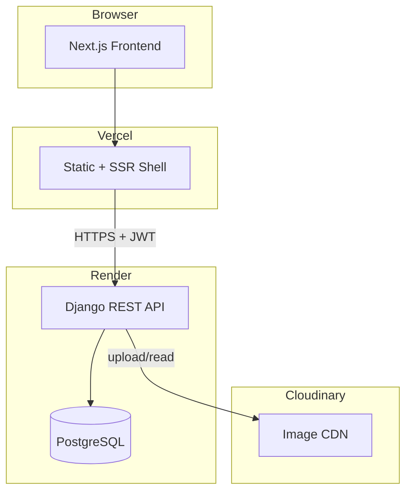

# High-level architecture

TaskFlow: browser UI on Vercel, Django API + PostgreSQL on Render, images on Cloudinary.

## Live endpoints

| Service | URL |
|---------|-----|
| Frontend | https://frontend-eight-beta-71.vercel.app |
| Backend API | https://taskflow-api-ub80.onrender.com |
| Health check | https://taskflow-api-ub80.onrender.com/api/health/ |
