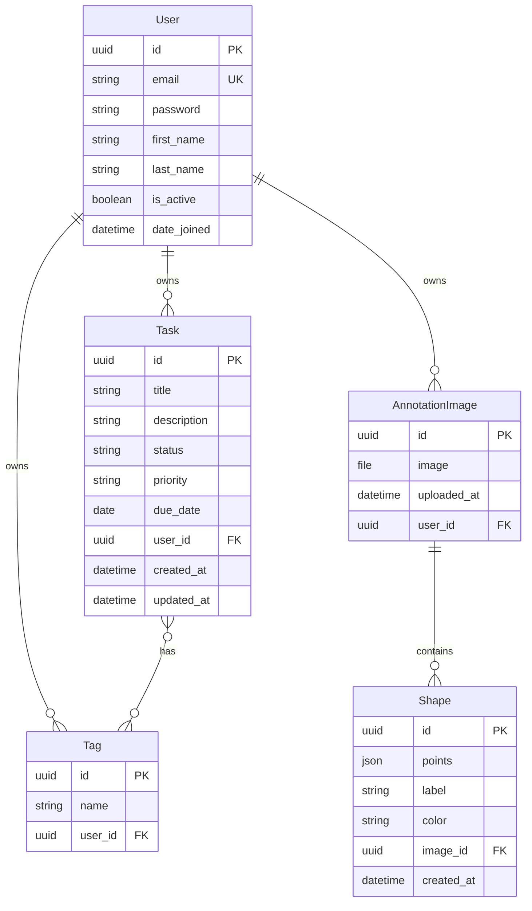

# Database models

Entity-relationship view of the Django PostgreSQL schema (SQLite locally).

## Notes

- All primary keys are UUIDs.
- Every row is scoped to `User` via foreign keys; APIs filter by `request.user`.
- `Shape.points` is JSON: `[{ "x": number, "y": number }, ...]` in original image pixel coordinates.
