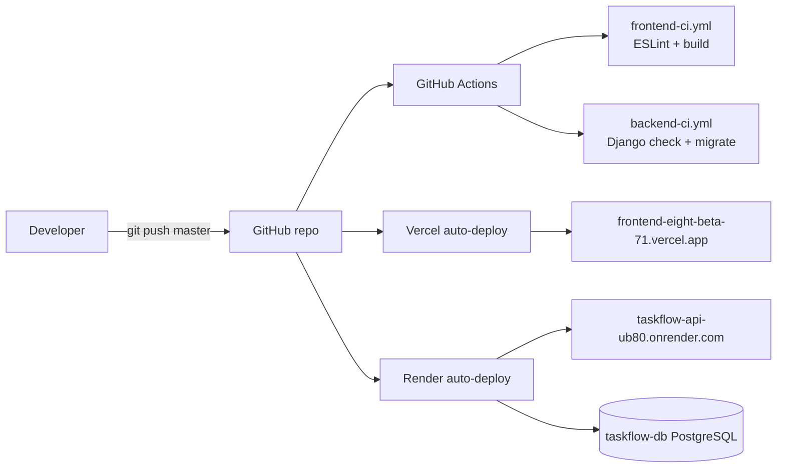

# CI/CD pipeline

Git push to `master` triggers GitHub Actions checks and automatic deploys to Vercel and Render.

## Workflows

| File | Trigger | Checks |
|------|---------|--------|
| `.github/workflows/frontend-ci.yml` | Changes in `frontend/` | `npm run lint`, `npm run build` |
| `.github/workflows/backend-ci.yml` | Changes in `backend/` | `manage.py check`, `migrate --noinput` |

## Deploy config

| App | Platform | Config |
|-----|----------|--------|
| Frontend | Vercel | Root dir: `frontend/` |
| Backend | Render | `render.yaml` + `backend/build.sh` |
